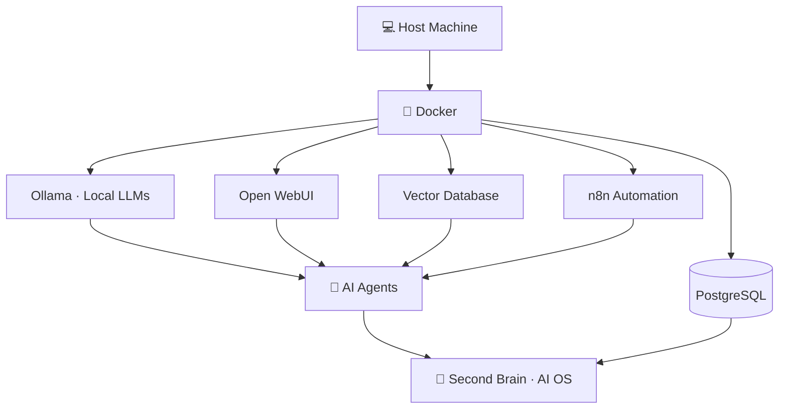

<div align="center">

<!-- ═══════════════════════════════════════════════════════════════ -->
<!--                  ANIMATED CAPSULE BANNER (TOP)                  -->
<!-- ═══════════════════════════════════════════════════════════════ -->


<!-- ═══════════════════════════════════════════════════════════════ -->
<!--               TYPING HEADLINE (Montserrat · no emoji)           -->
<!-- ═══════════════════════════════════════════════════════════════ -->

<a href="https://akash-sk-bio.github.io/portfolio/#hero">
  
</a>

<br/><br/>


</div>

<br/>

<!-- ═══════════════════════════════════════════════════════════════ -->
<!--                    ABOUT ME — Card Style                        -->
<!-- ═══════════════════════════════════════════════════════════════ -->

<div align="center">

## &nbsp; A B O U T &nbsp;&nbsp; M E &nbsp;

</div>

> **Informatics Engineer** working at the intersection of **AI, infrastructure, and biology.**
> I build autonomous AI systems, self-host the full AI stack, and engineer healthcare
> interoperability with **FHIR / HL7** — turning life-science data into intelligence.

<div align="center">


</div>

```text
   Role      →  Informatics Engineer
   Focus     →  Agentic AI · AI Infrastructure · Healthcare AI
   Location  →  Hyderabad, India
   Mission   →  Build intelligent, autonomous, self-hosted AI systems
```

<br/>

<!-- ═══════════════════════════════════════════════════════════════ -->
<!--                       NOW BUILDING                              -->
<!-- ═══════════════════════════════════════════════════════════════ -->

<div align="center">

## &nbsp; N O W &nbsp;&nbsp; B U I L D I N G &nbsp;

`🧠 Personal AI Operating System`&nbsp;&nbsp;`🤖 Autonomous Multi-Agent Workflows`

`⚙️ Self-hosted DevOps Infrastructure`&nbsp;&nbsp;`🌐 Local AI Stack`

`🔄 n8n Workflow Automation`&nbsp;&nbsp;`🧬 Healthcare AI on FHIR / HL7`

`📚 Open-source AI Experiments`

</div>

<br/>

<!-- ═══════════════════════════════════════════════════════════════ -->
<!--                           TECH STACK                            -->
<!-- ═══════════════════════════════════════════════════════════════ -->

<div align="center">

## &nbsp; T E C H &nbsp;&nbsp; S T A C K &nbsp;

<br/>

<b>🤖 AI Engineering</b>

<p>
  
  
  
  
  
  
  
  
  
</p>

<b>🔄 Automation</b>

<p>
  
  
  
  
  
  
</p>

<b>🛠️ DevOps &amp; Infrastructure</b>

<p>
  
</p>
<p>
  
  
  
  
  
</p>

<b>🧩 Backend</b>

<p>
  
</p>
<p>
  
  
</p>

<b>🖥️ Frontend</b>

<p>
  
</p>

<b>🧠 AI Infrastructure</b>

<p>
  
  
  
  
  
  
  
</p>

<b>🧬 Healthcare &amp; Data Science</b>

<p>
  
  
  
  
  
  
  
  
</p>

</div>

<br/>

<!-- ═══════════════════════════════════════════════════════════════ -->
<!--                       FEATURED WORK                             -->
<!-- ═══════════════════════════════════════════════════════════════ -->

<div align="center">

## &nbsp; F E A T U R E D &nbsp;&nbsp; W O R K &nbsp;

<br/>

<b>⚙️ AI Infrastructure</b>

</div>

> **Personal AI Operating System** — a self-hosted AI stack running on Docker:
> local LLMs (Ollama · Open WebUI), workflow automation (n8n), vector search,
> and full observability. A private "second brain" that automates and reasons.

<div align="center">

<br/>

<b>🧠 Applied ML / Biotech</b>

<br/><br/>

<a href="https://github.com/Akash-sk-bio/fake-profile-detection">
  
</a>
<a href="https://github.com/Akash-sk-bio/heart-attack-prediction">
  
</a>

<br/>

<a href="https://github.com/Akash-sk-bio/msc-stem-cell-count-prediction-ml">
  
</a>
<a href="https://github.com/Akash-sk-bio/biological-data-analysis-ml-lab">
  
</a>

<br/><br/>

<sub>Tap any card to open the repository →</sub>

</div>

<br/>

<!-- ═══════════════════════════════════════════════════════════════ -->
<!--                     ARCHITECTURE DIAGRAM                        -->
<!-- ═══════════════════════════════════════════════════════════════ -->

<div align="center">

## &nbsp; A R C H I T E C T U R E &nbsp;

<br/>

</div>



<br/>

<!-- ═══════════════════════════════════════════════════════════════ -->
<!--                       2026 TECH FOCUS                           -->
<!-- ═══════════════════════════════════════════════════════════════ -->

<div align="center">

## &nbsp; 2 0 2 6 &nbsp;&nbsp; R O A D M A P &nbsp;

</div>

```text
AI Agents           ████████████████████   Deep focus
n8n Automation      ██████████████████░░   Active
Docker / DevOps     ██████████████████░░   Active
LLM Infrastructure  ██████████████████░░   Active
Healthcare AI       ████████████████░░░░   Growing
Open Source         ██████████████░░░░░░   Ongoing
Content Creation    ██████████░░░░░░░░░░   Ongoing
```

<br/>

<!-- ═══════════════════════════════════════════════════════════════ -->
<!--                            CONNECT                              -->
<!-- ═══════════════════════════════════════════════════════════════ -->

<div align="center">

## &nbsp; C O N N E C T &nbsp;

<br/>

<a href="https://akash-sk-bio.github.io/portfolio/#hero">
  
</a>
<a href="https://www.linkedin.com/in/akash-sk-ai-biotech">
  
</a>
<a href="https://www.youtube.com/@AKASH-BIO-AI">
  
</a>
<a href="https://www.instagram.com/akash.bio.ai/">
  
</a>
<a href="mailto:akash.ai.biotech@gmail.com">
  
</a>
<a href="https://github.com/Akash-sk-bio">
  
</a>

</div>

<br/>

---

<!-- ═══════════════════════════════════════════════════════════════ -->
<!--                ANIMATED CAPSULE BANNER (BOTTOM)                 -->
<!-- ═══════════════════════════════════════════════════════════════ -->

<div align="center">


</div>
